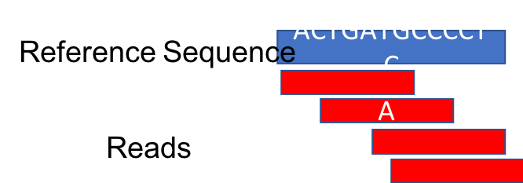

Approximate time: 20 minutes

## Learning Objectives

- Sort and Index SAM/BAM file
- Mark duplicate reads in BAM file


## Sort SAM file

It's necessary for downstream applications to sort reads by reference genome coordinates.
This will assist in fast search, display and other functions.
```markdown
SRR098401.109756285 163 chr10 94760647 60 76M = 94760653  82 ATTA…    ?>@@... 
                        ^^^^^^^^^^^^^^
                         coordinates
```

We’ll use the [Picard](https://broadinstitute.github.io/picard/) toolkit for SAM file manipulation.

Open another script in our course directory called picard.sh
```markdown
cd ..
nano picard.sh
```


Enter the following text:
```markdown
module load picard/2.8.0

picard SortSam \
INPUT=results/na12878.sam \
OUTPUT=results/na12878.srt.bam \
SORT_ORDER=coordinate
```

We have input our SAM file and we will output a Binary Alignment Map (BAM) file, which is a compressed version of SAM format.

Exit nano by typing `^X` and follow prompts to save the file `picard.sh`.

To run the script:
```markdown
sh picard.sh
```


Result 
```markdown
[Fri Nov 22 15:33:22 EST 2019] picard.sam.SortSam …
…
[Fri Nov 22 15:33:22 EST 2019] picard.sam.SortSam done. 
```

Take a look at the results directory:
```markdown
ls results
```

Result:
```markdown
na12878.sam  
na12878.srt.bam 
```

## Mark Duplicates in BAM file
In the sequencing process, many copies are made of a DNA fragment
The amount of duplication may not be the same for all sequences and can cause biases in variant calling
Therefore, we mark the duplicates so the variant caller can ignore them.


Duplicate reads are identified based on their alignment coordinates and CIGAR string.
For example, the below alignment appears to have a G to A mutation in the majority of reads:


However, when the duplicates are removed, the number of reads supporting the mutation drops to one.



Let's add this step to our `picard` script in order to illustrate how to include multiple steps in a single script.
Note that when we run it, we'll rerun our previous steps as well.

```markdown
nano picard.sh
```
Add the following lines to the end of our script:
```markdown
printf  'start mark duplicates\n\n'

picard MarkDuplicates \
INPUT=results/na12878.srt.bam \
OUTPUT=results/na12878.srt.markdup.bam \
METRICS_FILE=results/na12878.markdup.tx
```

The first line is a formatted print (`printf`) statement that will display useful log lines when our script is running.

To run our script:
```markdown
sh picard.sh
```

In addition to our previous log, we'll see
```markdown
…
starting mark duplicates
[Fri Nov 22 16:03:41 EST 2019] picard.sam.markduplicates.MarkDuplicates INPUT=…
Runtime.totalMemory()=9186050048
```
### Mark Duplicates Metrics file


| LIBRARY | UNPAIRED_READS_EXAMINED | READ_PAIRS_EXAMINED | SECONDARY_OR_SUPPLEMENTARY_RDS | UNMAPPED_READS | UNPAIRED_READ_DUPLICATES | READ_PAIR_DUPLICATES | READ_PAIR_OPTICAL_DUPLICATES | PERCENT_DUPLICATION | ESTIMATED_LIBRARY_SIZE |
|---|:---:|:---:|:---:|:---:|:---:|:---:|:---:|:---:|:---:|
| Unknown | 29 | 4620 | 2 | 35 | 14 | 425 | 0 | 0.093214 | 23546 | 


the hbc:
https://github.com/hbc/NGS_Data_Analysis_Course/blob/master/sessionVI/lessons/01_alignment.md

