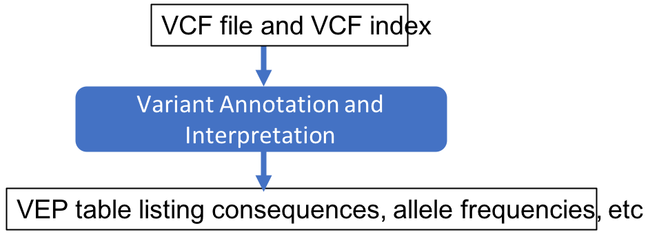

Approximate time: 20 minutes

## Learning Objectives

- Use the Variant Effect Predictor (VEP) online web server 

## Download the VCF

We'll download the VCF from the cluster.
1. Go back to [https://ondemand.cluster.tufts.edu](https://ondemand.cluster.tufts.edu)
2. In the top grey menu, click `Files` and select `Home Directory`.

3. Select `intro-to-ngs/results/na12878.vcf`

4. Click `Download`

## Run VEP

1. In web browser tab, navigate to to [https://useast.ensembl.org/Tools/VEP](https://useast.ensembl.org/Tools/VEP)
Note that VEP can also be run on the command line on our HPC, resulting in a text file (txt or vcf). 
You are welcome to ask for instructions to run the command line VEP.
For single VCF analysis, the web server is recommended. 

2. Choose species `Human (Homo sapiens)` (should be the default)

3. Next to `Or upload file:` navigate to the downloaded file `na12878.vcf`

3. Under `Transcript database to use` select `RefSeq transcripts`

4. Click `Run`

### Viewing VEP results

When your job is done, click `View Results`

### HERE ####
missense_variants change the amino acid
Let’s investigate!  

### Filtering VEP consequences

Under `Filters` choose `Consequence` + `is` + `missense_variant` and click `Add`

You should see 1 row - here are a subset of interesting columns

|Location | Allele | Consequence | IMPACT | SYMBOL | BIOTYPE | Amino_acids |
|:---:|:---:|:---:|:---:|:---:|:---:|:---:|
|10:94842866-94842866 | G | missense_variant | MODERATE | CYP2C19 | protein_coding | I/V |

| Existing_variation | SIFT | PolyPhen | AF |
|:---:|:---:|:---:|:---:|
| rs3758581,CM983294 | tolerated(0.38) | benign(0.05) | 0.9515 |

Explanation....

Consequence to impact:

SIFT, PolyPhen are computational algorithms to predict the  effect on protein function – both suggest this protein function will not be altered

Allele Frequency (AF) shows that this substation is common in the global population – which suggests it is not pathogenic.

## summary

[Previous: Variant Calling](05_Variant_Calling.md)
